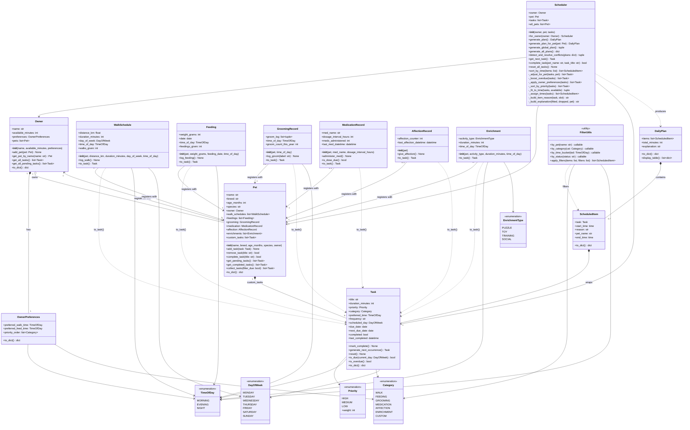

# PawPal+ UML Class Diagram

```mermaid
classDiagram
    direction TB

    class TimeOfDay {
        <<enumeration>>
        MORNING
        EVENING
        NIGHT
    }

    class DayOfWeek {
        <<enumeration>>
        MONDAY
        TUESDAY
        WEDNESDAY
        THURSDAY
        FRIDAY
        SATURDAY
        SUNDAY
    }

    class Priority {
        <<enumeration>>
        HIGH
        MEDIUM
        LOW
        +weight: int
    }

    class Category {
        <<enumeration>>
        WALK
        FEEDING
        GROOMING
        MEDICATION
        AFFECTION
        ENRICHMENT
        CUSTOM
    }

    class EnrichmentType {
        <<enumeration>>
        PUZZLE
        TOY
        TRAINING
        SOCIAL
    }

    class OwnerPreferences {
        +preferred_walk_time: TimeOfDay
        +preferred_feed_time: TimeOfDay
        +priority_order: list~Category~
        +to_dict() dict
    }

    class Owner {
        +name: str
        +available_minutes: int
        +preferences: OwnerPreferences
        +pets: list~Pet~
        +__init__(name, available_minutes, preferences)
        +add_pet(pet: Pet) None
        +get_pet_by_name(name: str) Pet
        +get_all_tasks() list~Task~
        +get_all_pending_tasks() list~Task~
        +to_dict() dict
    }

    class Pet {
        +name: str
        +breed: str
        +age_months: int
        +species: str
        +owner: Owner
        +walk_schedules: list~WalkSchedule~
        +feedings: list~Feeding~
        +grooming: GroomingRecord
        +medication: MedicationRecord
        +affection: AffectionRecord
        +enrichments: list~Enrichment~
        +custom_tasks: list~Task~
        +__init__(name, breed, age_months, species, owner)
        +add_task(task: Task) None
        +remove_task(title: str) bool
        +complete_task(title: str) bool
        +get_pending_tasks() list~Task~
        +get_completed_tasks() list~Task~
        +collect_tasks(filter_due: bool) list~Task~
        +to_dict() dict
    }

    class Task {
        +title: str
        +duration_minutes: int
        +priority: Priority
        +category: Category
        +preferred_time: TimeOfDay
        +frequency: str
        +scheduled_day: DayOfWeek
        +due_date: date
        +next_due_date: date
        +completed: bool
        +last_completed: datetime
        +mark_complete() None
        +generate_next_occurrence() Task
        +reset() None
        +is_due(current_day: DayOfWeek) bool
        +is_overdue() bool
        +to_dict() dict
    }

    class WalkSchedule {
        +distance_km: float
        +duration_minutes: int
        +day_of_week: DayOfWeek
        +time_of_day: TimeOfDay
        +walks_given: int
        +__init__(pet, distance_km, duration_minutes, day_of_week, time_of_day)
        +log_walk() None
        +to_task() Task
    }

    class Feeding {
        +weight_grams: int
        +date: date
        +time_of_day: TimeOfDay
        +feedings_given: int
        +__init__(pet, weight_grams, feeding_date, time_of_day)
        +log_feeding() None
        +to_task() Task
    }

    class GroomingRecord {
        +groom_log: list~tuple~
        +time_of_day: TimeOfDay
        +__init__(pet, time_of_day)
        +log_groom(label: str) None
        +groom_count_this_year: int
        +to_task() Task
    }

    class MedicationRecord {
        +med_name: str
        +dosage_interval_hours: int
        +meds_administered: int
        +last_med_datetime: datetime
        +__init__(pet, med_name, dosage_interval_hours)
        +administer_med() None
        +is_dose_due() bool
        +to_task() Task
    }

    class AffectionRecord {
        +affection_counter: int
        +last_affection_datetime: datetime
        +__init__(pet)
        +give_affection() None
        +to_task() Task
    }

    class Enrichment {
        +activity_type: EnrichmentType
        +duration_minutes: int
        +time_of_day: TimeOfDay
        +__init__(pet, activity_type, duration_minutes, time_of_day)
        +to_task() Task
    }

    class ScheduledItem {
        +task: Task
        +start_time: time
        +reason: str
        +pet_name: str
        +end_time: time
        +to_dict() dict
    }

    class DailyPlan {
        +items: list~ScheduledItem~
        +total_minutes: int
        +explanation: str
        +to_dict() dict
        +display_table() list~dict~
    }

    class Scheduler {
        +owner: Owner
        +pet: Pet
        +tasks: list~Task~
        +all_pets: list~Pet~
        +__init__(owner, pet, tasks)
        +for_owner(owner: Owner) Scheduler
        +generate_plan() DailyPlan
        +generate_plan_for_pet(pet: Pet) DailyPlan
        +generate_global_plan() tuple
        +generate_all_plans() dict
        +detect_and_resolve_conflicts(plans: dict) tuple
        +get_next_task() Task
        +complete_task(pet_name: str, task_title: str) bool
        +reset_all_tasks() None
        +sort_by_time(items: list) list~ScheduledItem~
        -_adjust_for_pet(tasks, pet) list~Task~
        -_boost_overdue(tasks) list~Task~
        -_apply_owner_preferences(tasks) list~Task~
        -_sort_by_priority(tasks) list~Task~
        -_fit_to_time(tasks, available) tuple
        -_assign_times(tasks) list~ScheduledItem~
        -_build_item_reason(task, slot) str
        -_build_explanation(fitted, dropped, pet) str
    }

    class FilterUtils {
        <<utility>>
        +by_pet(name: str) callable
        +by_category(cat: Category) callable
        +by_time_bucket(tod: TimeOfDay) callable
        +by_status(status: str) callable
        +apply_filters(items: list, filters: list) list~ScheduledItem~
    }

    %% Owner <-> OwnerPreferences
    Owner "1" *-- "1" OwnerPreferences : has

    %% Owner <-> Pet (bidirectional)
    Owner "1" o-- "0..*" Pet : owns
    Pet "1" --> "1" Owner : registered with

    %% Pet stores custom tasks directly
    Pet "1" *-- "0..*" Task : custom_tasks

    %% Care records register themselves with Pet in constructor
    WalkSchedule "0..*" --> "1" Pet : registers with
    Feeding "0..*" --> "1" Pet : registers with
    GroomingRecord "0..1" --> "1" Pet : registers with
    MedicationRecord "0..1" --> "1" Pet : registers with
    AffectionRecord "0..1" --> "1" Pet : registers with
    Enrichment "0..*" --> "1" Pet : registers with

    %% Care records produce Tasks
    WalkSchedule ..> Task : to_task()
    Feeding ..> Task : to_task()
    GroomingRecord ..> Task : to_task()
    MedicationRecord ..> Task : to_task()
    AffectionRecord ..> Task : to_task()
    Enrichment ..> Task : to_task()

    %% Enum usage
    WalkSchedule --> TimeOfDay
    WalkSchedule --> DayOfWeek
    Feeding --> TimeOfDay
    GroomingRecord --> TimeOfDay
    Enrichment --> TimeOfDay
    Enrichment --> EnrichmentType
    Task --> Priority
    Task --> TimeOfDay
    Task --> Category
    Task --> DayOfWeek
    OwnerPreferences --> TimeOfDay
    OwnerPreferences --> Category

    %% Scheduler orchestration
    Scheduler --> Owner
    Scheduler --> Pet
    Scheduler --> Task
    Scheduler ..> DailyPlan : produces

    %% DailyPlan composition
    DailyPlan *-- "0..*" ScheduledItem : contains
    ScheduledItem *-- "1" Task : wraps

    %% Filter utilities
    FilterUtils ..> ScheduledItem : filters
    FilterUtils --> Category
    FilterUtils --> TimeOfDay
```
