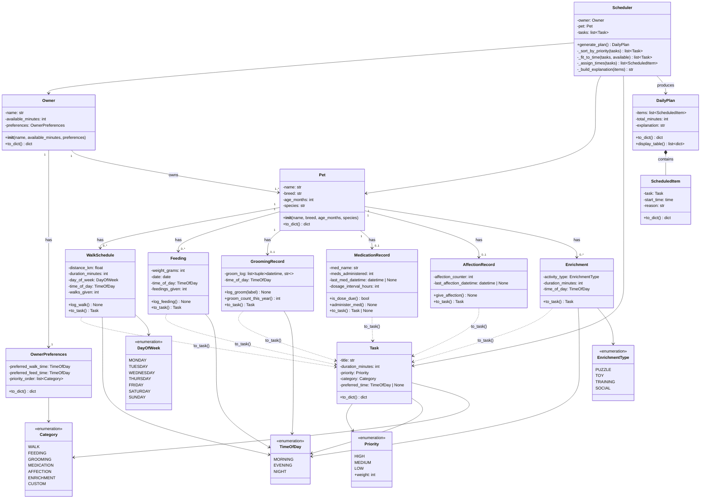

# PawPal+ UML Class Diagram

```mermaid
classDiagram
    direction TB

    class TimeOfDay {
        <<enumeration>>
        MORNING
        EVENING
        NIGHT
    }

    class DayOfWeek {
        <<enumeration>>
        MONDAY
        TUESDAY
        WEDNESDAY
        THURSDAY
        FRIDAY
        SATURDAY
        SUNDAY
    }

    class Priority {
        <<enumeration>>
        HIGH
        MEDIUM
        LOW
        +weight: int
    }

    class Category {
        <<enumeration>>
        WALK
        FEEDING
        GROOMING
        MEDICATION
        AFFECTION
        ENRICHMENT
        CUSTOM
    }

    class EnrichmentType {
        <<enumeration>>
        PUZZLE
        TOY
        TRAINING
        SOCIAL
    }

    class OwnerPreferences {
        -preferred_walk_time: TimeOfDay
        -preferred_feed_time: TimeOfDay
        -priority_order: list~Category~
        +to_dict() dict
    }

    class Owner {
        -name: str
        -available_minutes: int
        -preferences: OwnerPreferences
        +__init__(name, available_minutes, preferences)
        +to_dict() dict
    }

    class Pet {
        -name: str
        -breed: str
        -age_months: int
        -species: str
        +__init__(name, breed, age_months, species)
        +to_dict() dict
    }

    class Task {
        -title: str
        -duration_minutes: int
        -priority: Priority
        -category: Category
        -preferred_time: TimeOfDay | None
        +to_dict() dict
    }

    class WalkSchedule {
        -distance_km: float
        -duration_minutes: int
        -day_of_week: DayOfWeek
        -time_of_day: TimeOfDay
        -walks_given: int
        +log_walk() None
        +to_task() Task
    }

    class Feeding {
        -weight_grams: int
        -date: date
        -time_of_day: TimeOfDay
        -feedings_given: int
        +log_feeding() None
        +to_task() Task
    }

    class GroomingRecord {
        -groom_log: list~tuple~datetime, str~~
        -time_of_day: TimeOfDay
        +log_groom(label) None
        +groom_count_this_year() int
        +to_task() Task
    }

    class MedicationRecord {
        -med_name: str
        -meds_administered: int
        -last_med_datetime: datetime | None
        -dosage_interval_hours: int
        +is_dose_due() bool
        +administer_med() None
        +to_task() Task | None
    }

    class AffectionRecord {
        -affection_counter: int
        -last_affection_datetime: datetime | None
        +give_affection() None
        +to_task() Task
    }

    class Enrichment {
        -activity_type: EnrichmentType
        -duration_minutes: int
        -time_of_day: TimeOfDay
        +to_task() Task
    }

    class ScheduledItem {
        -task: Task
        -start_time: time
        -reason: str
        +to_dict() dict
    }

    class DailyPlan {
        -items: list~ScheduledItem~
        -total_minutes: int
        -explanation: str
        +to_dict() dict
        +display_table() list~dict~
    }

    class Scheduler {
        -owner: Owner
        -pet: Pet
        -tasks: list~Task~
        +generate_plan() DailyPlan
        -_sort_by_priority(tasks) list~Task~
        -_fit_to_time(tasks, available) list~Task~
        -_assign_times(tasks) list~ScheduledItem~
        -_build_explanation(items) str
    }

    Owner "1" --> "1" OwnerPreferences : has
    Owner "1" --> "1..*" Pet : owns
    Pet "1" --> "0..*" WalkSchedule : has
    Pet "1" --> "0..*" Feeding : has
    Pet "1" --> "0..1" GroomingRecord : has
    Pet "1" --> "0..1" MedicationRecord : has
    Pet "1" --> "0..1" AffectionRecord : has
    Pet "1" --> "0..*" Enrichment : has
    WalkSchedule ..> Task : to_task()
    Feeding ..> Task : to_task()
    GroomingRecord ..> Task : to_task()
    MedicationRecord ..> Task : to_task()
    AffectionRecord ..> Task : to_task()
    Enrichment ..> Task : to_task()
    WalkSchedule --> TimeOfDay
    WalkSchedule --> DayOfWeek
    Feeding --> TimeOfDay
    GroomingRecord --> TimeOfDay
    Enrichment --> TimeOfDay
    Enrichment --> EnrichmentType
    Task --> Priority
    Task --> TimeOfDay
    Task --> Category
    OwnerPreferences --> Category
    Scheduler --> Owner
    Scheduler --> Pet
    Scheduler --> Task
    Scheduler --> DailyPlan : produces
    DailyPlan *-- ScheduledItem : contains
```
